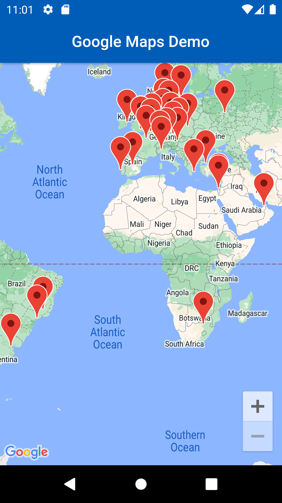
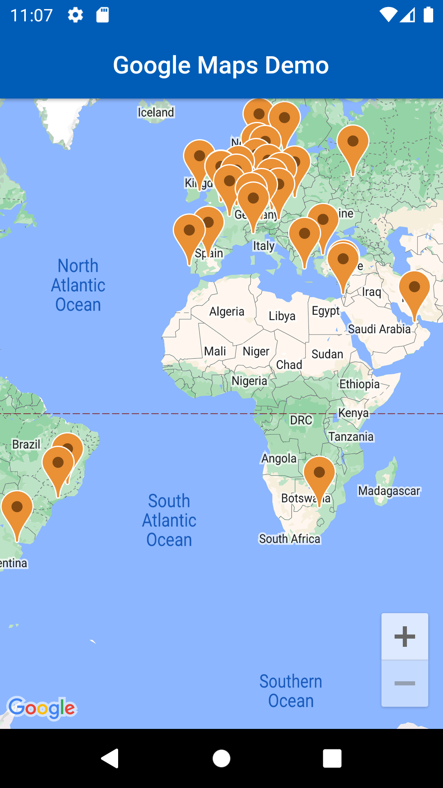
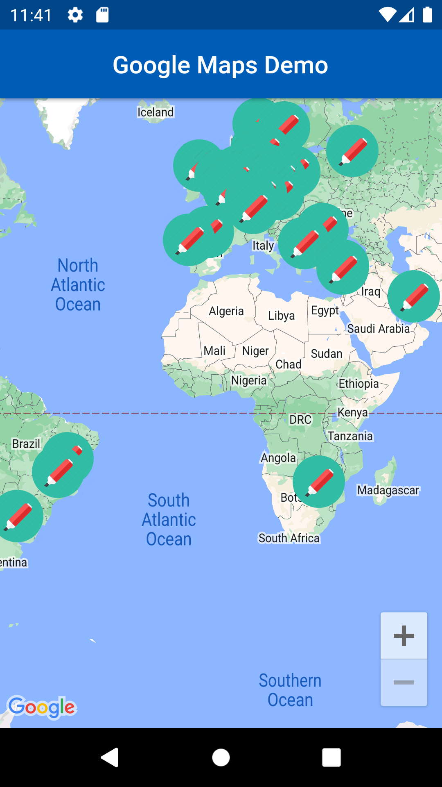

# Flutter'a Nasıl Google Maps Eklenir
Boş bir flutter projesi oluşturduktan sonra bağımlılıklarımızı indirmemiz gerekiyor.
```shell
 flutter pub add google_maps_flutter
```
Komutunu çalıştırarak gerekli olan bağımlılığımızı ekliyoruz.
## Android Yapılandırmasını Yapmak.
Android'de Google Haritalar SDK'sını kullanmak için minSDK'nın 20 olarak ayarlanması gerekiyor.

    ➡android/app/build.gradle
```gradle
android{
    ...
    defaultConfig {
        applicationId "com.example.flutter_google_map"
        minSdkVersion 20
        targetSdkVersion flutter.targetSdkVersion
        versionCode flutterVersionCode.toInteger()
        versionName flutterVersionName
        }
    }
```
## API Key Eklemek
Flutter uygulamalarınızda Google Haritalar kullanabilmek için [Google Developer Console](https://console.cloud.google.com)'dan Google Map API Key almanız gerekiyor.

[Maps SDK for Android](https://console.cloud.google.com/marketplace/product/google/maps-android-backend.googleapis.com?q=search&referrer=search&project=cool-eye-375911)

API Key'inizi nereye yazmanız gerektiği aşağıda gösterilmiştir ```<application>``` etiketinin içinde diğer etiketler ile çakışmayacak bir yere girebilirsiniz.

    ➡android/app/src/main/AndroidManifest.xml
```xml
<manifest xmlns:android="http://schemas.android.com/apk/res/android"
    package="com.example.flutter_google_map">
   <application
        android:label="flutter_google_map"
        android:name="${applicationName}"
        android:icon="@mipmap/ic_launcher">
        <activity
            android:name=".MainActivity"
            android:exported="true"
            android:launchMode="singleTop"
            android:theme="@style/LaunchTheme"
            android:configChanges="orientation|keyboardHidden|keyboard|screenSize|smallestScreenSize|locale|layoutDirection|fontScale|screenLayout|density|uiMode"
            android:hardwareAccelerated="true"
            android:windowSoftInputMode="adjustResize">
            <meta-data
              android:name="io.flutter.embedding.android.NormalTheme"
              android:resource="@style/NormalTheme"
              />
            <intent-filter>
                <action android:name="android.intent.action.MAIN"/>
                <category android:name="android.intent.category.LAUNCHER"/>
            </intent-filter>
        </activity>
        <meta-data
            android:name="flutterEmbedding"
            android:value="2" />
        <!-- TODO: Google Map API Key'inizi giriniz -->
        <meta-data android:name="com.google.android.geo.API_KEY"
               android:value="YOUR-KEY-HERE"/>
    </application>
</manifest>
```
## İlk Google Map Görüntüsünü Elde Etmek
    ➡lib/main.dart
``` dart
import 'package:flutter/material.dart';
import 'package:google_maps_flutter/google_maps_flutter.dart';

void main() => runApp(const MyApp());

class MyApp extends StatefulWidget {
  const MyApp({super.key});

  @override
  State<MyApp> createState() => _MyAppState();
}

class _MyAppState extends State<MyApp> {
  late GoogleMapController mapController;
  void _onMapCreated(GoogleMapController controller) {
    mapController = controller;
  }

  @override
  Widget build(BuildContext context) {
    return MaterialApp(
      debugShowCheckedModeBanner: false,
      theme: ThemeData(
        colorSchemeSeed: Colors.blue[800],
      ),
      home: Scaffold(
        appBar: AppBar(
          title: const Text('Google Maps Demo'),
          centerTitle: true,
          elevation: 2,
        ),
        // GoogleMap widgetini body kısmına ekliyoruz ve onMapCreated fonksiyonunu çağırıyoruz
        // onMapCreated fonksiyonu ile mapController değişkenine erişebiliyoruz
        body: GoogleMap(
          onMapCreated: _onMapCreated,
          // "initialCameraPosition:" Sayfa açıldığında gözükecek konum ve zoom değeri
          initialCameraPosition: const CameraPosition(
            target: LatLng(38.868862, 35.428293),
            zoom: 7,
          ),
        ),
      ),
    );
  }
}
```


## Marker Eklemek
[Asıl Örnek](https://codelabs.developers.google.com/codelabs/google-maps-in-flutter/#0)

Şimdi haritamıza markerlar eklemeyi gösterecem Google'ın hazırladığı dökümandaki örneği kullanacam bunu için. Google flutter uygulamalrınıza Google Maps eklemek için hazırladığı dökümanda Google ofislerini seçmişti biz de onu kullanacağız ama Google'a ek olarak farklı marker stilleri nasıl kullanırız ona değinecez.

Projemize bazı bağımlılıklar eklememiz gerekecek
json_serializable , json_annotation ve build_runner

    ➡Terminal
```bash
$ flutter pub add json_serializable
$ flutter pub add json_annotation 
$ flutter pub add --dev build_runner
```

Kullanacağımız [JSON dosyasını](./flutter_google_map/assets/locations.json) projemizin ana dosyasında assets adında bir klasör oluşturup onun içine atıyoruz
  ./assets/locations.json
ve asset'lerimizi kullanabilmek için fluttter'da pubspec.yaml dosyamızda belirtmemiz lazım.
Not:assets kısmı ve altındaki yol tarifinin konumlandırması aynı olmak zorundadır.
```yaml
flutter:
  uses-material-design: true

  assets:
    - assets/locations.json
```
Şimdi ise modelimizi oluşturmamız lazım
    ➡lib/src/locations.dart
```dart
import 'dart:convert';

import 'package:flutter/foundation.dart';
import 'package:flutter/services.dart' show rootBundle;
import 'package:json_annotation/json_annotation.dart';

part 'locations.g.dart';

@JsonSerializable()
class LatLng {
  LatLng({
    required this.lat,
    required this.lng,
  });

  factory LatLng.fromJson(Map<String, dynamic> json) => _$LatLngFromJson(json);
  Map<String, dynamic> toJson() => _$LatLngToJson(this);

  final double lat;
  final double lng;
}

@JsonSerializable()
class Region {
  Region({
    required this.coords,
    required this.id,
    required this.name,
    required this.zoom,
  });

  factory Region.fromJson(Map<String, dynamic> json) => _$RegionFromJson(json);
  Map<String, dynamic> toJson() => _$RegionToJson(this);

  final LatLng coords;
  final String id;
  final String name;
  final double zoom;
}

@JsonSerializable()
class Office {
  Office({
    required this.address,
    required this.id,
    required this.image,
    required this.lat,
    required this.lng,
    required this.name,
    required this.phone,
    required this.region,
  });

  factory Office.fromJson(Map<String, dynamic> json) => _$OfficeFromJson(json);
  Map<String, dynamic> toJson() => _$OfficeToJson(this);

  final String address;
  final String id;
  final String image;
  final double lat;
  final double lng;
  final String name;
  final String phone;
  final String region;
}

@JsonSerializable()
class Locations {
  Locations({
    required this.offices,
    required this.regions,
  });

  factory Locations.fromJson(Map<String, dynamic> json) =>
      _$LocationsFromJson(json);
  Map<String, dynamic> toJson() => _$LocationsToJson(this);

  final List<Office> offices;
  final List<Region> regions;
}

Future<Locations> getGoogleOffices() async {
  return Locations.fromJson(
    json.decode(
      await rootBundle.loadString('assets/locations.json'),
    ) as Map<String, dynamic>,
  );
}
```
Modelimizi oluşturduktan sonra eklemiş olduğumuz build_runner paketi ile build almamız gerekecek bunun nedeni ise ```@JsonSerializable``` gibi anotasyonlar ve ```part 'locations.g.dart'; ``` gibi bir parça bağımlılığı oluşturduğumuz için.

    ➡Terminal
```bash
$ flutter pub run build_runner build --delete-conflicting-outputs
```
Main sayfamızda bu kodları yazarsak çıktımız bu olacak.
    ➡lib/main.dart
```dart
import 'package:flutter/material.dart';
import 'package:google_maps_flutter/google_maps_flutter.dart';
import 'src/locations.dart' as locations;

void main() {
  runApp(const MyApp());
}

class MyApp extends StatefulWidget {
  const MyApp({super.key});

  @override
  State<MyApp> createState() => _MyAppState();
}

class _MyAppState extends State<MyApp> {
  final Map<String, Marker> _markers = {};
  Future<void> _onMapCreated(GoogleMapController controller) async {
    final googleOffices = await locations.getGoogleOffices();
    setState(() {
      _markers.clear();
      for (final office in googleOffices.offices) {
        final marker = Marker(
          markerId: MarkerId(office.name),
          position: LatLng(office.lat, office.lng),
          infoWindow: InfoWindow(
            title: office.name,
            snippet: office.address,
          ),
        );
        _markers[office.name] = marker;
      }
    });
  }

  @override
  Widget build(BuildContext context) {
    return MaterialApp(
      debugShowCheckedModeBanner: false,
      theme: ThemeData(
        colorSchemeSeed: Colors.blue[800],
      ),
      home: Scaffold(
        appBar: AppBar(
          title: const Text('Google Maps Demo'),
          centerTitle: true,
          elevation: 2,
        ),
        body: GoogleMap(
          onMapCreated: _onMapCreated,
          initialCameraPosition: const CameraPosition(
            target: LatLng(0, 0),
            zoom: 2,
          ),
          markers: _markers.values.toSet(),
        ),
      ),
    );
  }
}
```


## Marker Renkleri Değiştirme
Haritamızı ekledik, haritamıza json dosyamızdan çektiğimiz markerları ekledik şimdi sırada bu markerların renklerini değiştirmek var.
Main dosyamızda olan 
```dart
  Future<void> _onMapCreated(GoogleMapController controller) async {
    final googleOffices = await locations.getGoogleOffices();
    setState(() {
      _markers.clear();
      for (final office in googleOffices.offices) {
        final marker = Marker(
          markerId: MarkerId(office.name),
          position: LatLng(office.lat, office.lng),
          infoWindow: InfoWindow(
            title: office.name,
            snippet: office.address,
          ),
        );
        _markers[office.name] = marker;
      }
    });
  }
```
kodumuza geldiğmizde şunu farkedebilirsiniz bizim markerlarımızın ayarlanmasını burada yapıyoruz eğer Marker widgetı içerisine icon özelliğini kullanırsak.
```dart
  Future<void> _onMapCreated(GoogleMapController controller) async {
    final googleOffices = await locations.getGoogleOffices();
    setState(() {
      _markers.clear();
      for (final office in googleOffices.offices) {
        final marker = Marker(
          markerId: MarkerId(office.name),
          position: LatLng(office.lat, office.lng),
          icon: BitmapDescriptor.defaultMarkerWithHue(
            BitmapDescriptor.hueOrange,
          ),
          infoWindow: InfoWindow(
            title: office.name,
            snippet: office.address,
          ),
        );
        _markers[office.name] = marker;
      }
    });
  }
```
Kırmızı olan markerların turuncu olacağını görebilirsiniz.



hueOrange gibi bir çok özellik var istediğinizi deneyebilirsiniz.

## Farklı Bir Marker Eklemek
Öncelikle bir ikon bulmamız gerekiyor ben marker yazdığımda gözüme güzel gözüken bir tane seçtim


Marker widgetımın icon özelliği benden BitmapDescriptor tipinde bir nesne istiyor şuan BitmapDescriptor'a istediğimiz görseli verecez.

```dart
      final BitmapDescriptor markerIcon = await BitmapDescriptor.fromAssetImage(
      ImageConfiguration(
        devicePixelRatio: 2.5,
        size: Size(32, 37),
      ),
      'assets/marker.png',
    );
```
Oluşturuyoruz ve icon özelliğimize markerIcon'u veriyoruz.
```dart
    icon: markerIcon,
```

