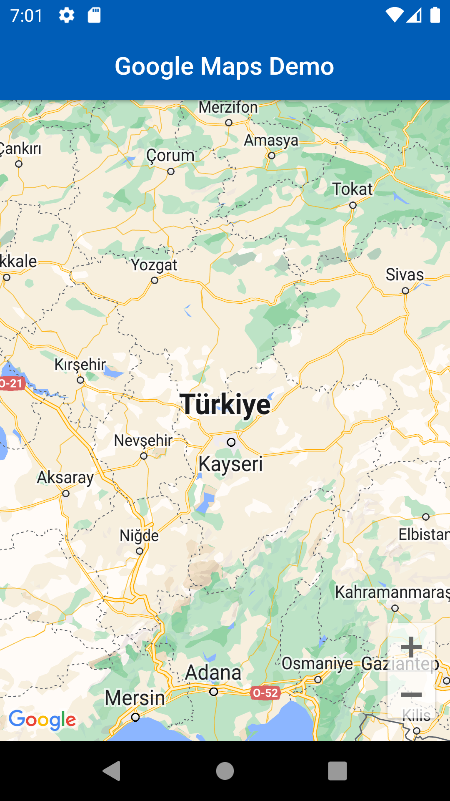

# Flutter'a Nasıl Google Maps Eklenir
Boş bir flutter projesi oluşturduktan sonra bağımlılıklarımızı indirmemiz gerekiyor.
```shell
 flutter pub add google_maps_flutter
```
Komutunu çalıştırarak gerekli olan bağımlılığımızı ekliyoruz.
## Android Yapılandırmasını Yapmak.
Android'de Google Haritalar SDK'sını kullanmak için minSDK'nın 20 olarak ayarlanması gerekiyor.

    ➡android/app/build.gradle
```gradle
android{
    ...
    defaultConfig {
        applicationId "com.example.flutter_google_map"
        minSdkVersion 20
        targetSdkVersion flutter.targetSdkVersion
        versionCode flutterVersionCode.toInteger()
        versionName flutterVersionName
        }
    }
```
## API Key Eklemek
Flutter uygulamalarınızda Google Haritalar kullanabilmek için [Google Developer Console](https://console.cloud.google.com)'dan Google Map API Key almanız gerekiyor.

[Maps SDK for Android](https://console.cloud.google.com/marketplace/product/google/maps-android-backend.googleapis.com?q=search&referrer=search&project=cool-eye-375911)

API Key'inizi nereye yazmanız gerektiği aşağıda gösterilmiştir ```<application>``` etiketinin içinde diğer etiketler ile çakışmayacak bir yere girebilirsiniz.

    ➡android/app/src/main/AndroidManifest.xml
```xml
<manifest xmlns:android="http://schemas.android.com/apk/res/android"
    package="com.example.flutter_google_map">
   <application
        android:label="flutter_google_map"
        android:name="${applicationName}"
        android:icon="@mipmap/ic_launcher">
        <activity
            android:name=".MainActivity"
            android:exported="true"
            android:launchMode="singleTop"
            android:theme="@style/LaunchTheme"
            android:configChanges="orientation|keyboardHidden|keyboard|screenSize|smallestScreenSize|locale|layoutDirection|fontScale|screenLayout|density|uiMode"
            android:hardwareAccelerated="true"
            android:windowSoftInputMode="adjustResize">
            <meta-data
              android:name="io.flutter.embedding.android.NormalTheme"
              android:resource="@style/NormalTheme"
              />
            <intent-filter>
                <action android:name="android.intent.action.MAIN"/>
                <category android:name="android.intent.category.LAUNCHER"/>
            </intent-filter>
        </activity>
        <meta-data
            android:name="flutterEmbedding"
            android:value="2" />
        <!-- TODO: Google Map API Key'inizi giriniz -->
        <meta-data android:name="com.google.android.geo.API_KEY"
               android:value="YOUR-KEY-HERE"/>
    </application>
</manifest>
```
## İlk Google Map Görüntüsünü Elde Etmek
    ➡lib/main.dart
``` dart
import 'package:flutter/material.dart';
import 'package:google_maps_flutter/google_maps_flutter.dart';

void main() => runApp(const MyApp());

class MyApp extends StatefulWidget {
  const MyApp({super.key});

  @override
  State<MyApp> createState() => _MyAppState();
}

class _MyAppState extends State<MyApp> {
  late GoogleMapController mapController;
  void _onMapCreated(GoogleMapController controller) {
    mapController = controller;
  }

  @override
  Widget build(BuildContext context) {
    return MaterialApp(
      debugShowCheckedModeBanner: false,
      theme: ThemeData(
        colorSchemeSeed: Colors.blue[800],
      ),
      home: Scaffold(
        appBar: AppBar(
          title: const Text('Google Maps Demo'),
          centerTitle: true,
          elevation: 2,
        ),
        // GoogleMap widgetini body kısmına ekliyoruz ve onMapCreated fonksiyonunu çağırıyoruz
        // onMapCreated fonksiyonu ile mapController değişkenine erişebiliyoruz
        body: GoogleMap(
          onMapCreated: _onMapCreated,
          // "initialCameraPosition:" Sayfa açıldığında gözükecek konum ve zoom değeri
          initialCameraPosition: const CameraPosition(
            target: LatLng(38.868862, 35.428293),
            zoom: 7,
          ),
        ),
      ),
    );
  }
}
```

